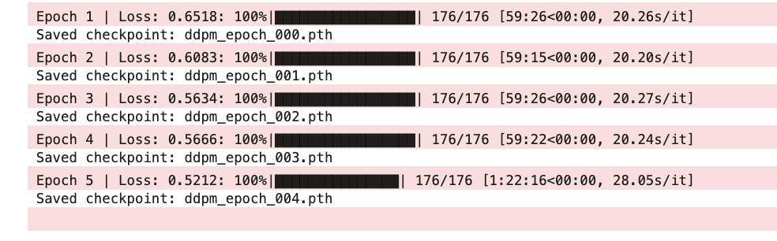
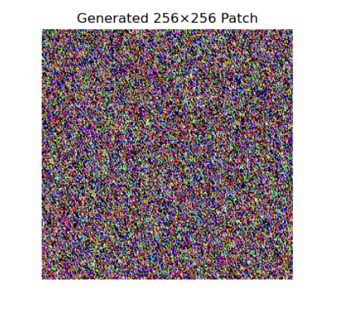

# INF367A - Implementation of Paper (`README.md`)

&nbsp;

### Paper:

*SatSynth: Augmenting Image-Mask Pairs through Diffusion Models for Aerial Semantic Segmentation*

&nbsp;

### Description:

In the notebook `satsynth_implementation_version_2.ipynb` I have implemented the novel method explained in the paper. This is related to synthesizing both image and label jointly via diffusion explained in the SatSynth paper. This implementation will furthermore be used for downstream segmentation in our [identifying deforestation drivers](https://solafune.com/competitions/68ad4759-4686-4bb3-94b8-7063f755b43d?menu=about&tab=overview) competition. The method is utilizing a Denoising Diffusion Probabilistic Model (DDPM) to generate a synthetic dataset w. labels denoted $\mathcal{D'}$. The union $\mathcal{D} \cup \mathcal{D'}$ is then utilized.

&nbsp;

#### Disclaimer before reading:

I have already talked to Nello about this matter, and its regarding diffusion models as a whole. This is about whether or not we are actually expected to make working models, this is related to that its not part of any curriculum at UiB (to my understanding). Thus, as my chosen paper does not include a public repository with implementation details, I have to try my best to implement it from scratch and at least show the methodology related to the paper. 

&nbsp;

### Method:
The SatSynth paper essentially explains how we can use a synthesized dataset $\mathcal{D'}$ in union with the original dataset $\mathcal{D}$, for downstream segmentation to achieve better results. This is related to an ongoing problem related to lack of annotation in remote sensing and satellite imagery. The paper explains three novelties for creating such a synthesized dataset $\mathcal{D'}$, this is namely:

- *Discrete labels in bit-space*
- *Synthesizing both image and label w. diffusion*
- *Image Super-resolution*

The first novelty is explaining how the binary-label encoding is used to jointly synthesize images and labels while ensuring a continuous representation suitable for generative models. Unlike one-hot encoding, which requires $K$ channels for $K$ classes, binary encoding represents classes using only $\log_2 K$ channels. This results in a more compact representation, reducing the number of additional channels while maintaining compatibility with continuous generative models.

The second is novelty is about synthesizing both data and label by normalizing the RGB values also on the scale from 0 to 1 (i.e. $[0,1]$). Now that everything is on the same scale we can train the diffusion model $\mathcal{G}$ and synthesize new images with corresponding labels. 

Lastly, we have super-resolution. The Image super-resolution is a technique used to bypass training of high resolution pictures on diffusion models which is both slow and costly. The bypassing is done via utilizing a second diffusion model $\mathcal{G}_{sr}$ which upscales the synthesized pictures by a scale of 2, such that: $\mathbb{R}^{C\times H\times W}\rightarrow\mathbb{R}^{C\times 2H\times 2W}$.

&nbsp;

### Current Implementation:
In the included `satsynth_implementation_version_2.ipynb` we have implemented 2 of the 3 above mentioned novelties explained in the paper to diffuse images for the synthesized dataset $\mathcal{D'}$. 

Starting off we define two dataset classes `SatelliteImgDataset` and `FixedGridCropDataset`, which are both instances of `torch.utils.data.Dataset`. The first of the two works by having paths to the data and when `__getitem__()` function is called retrieving the current image and label, before normalizing the image ($[0,1]$) and binary-label encoding the labels as additional channels in the image. Afterwards it re-scales from $[0,1] \rightarrow[-1,1]$ for numerical stability. Finally, it returns an `torch.tensor` which has the following shape $[-1,1]^{(C+\log_2 K) \times H\times W}$ .  The latter of the two datasets retrieves $256\times256px$ patches of images from this dataset, in this way it functions as a wrapper.

Afterwards we move on to define a quick sanity check to see that it functions as it should. Then we define the building blocks of the UNet backbone, which is the main component of noise prediction in the paper. They are not specific with the specifics in the implementation of the UNet in the paper, so I've had some creative freedom surrounding it. The UNet `UNet_w_res_blocks()` is constructed using residual blocks which are infused time embedding for the time steps in the diffusion process (i.e. $t=0, \ldots, T$).
&nbsp;

Lastly, we define the `DDPM` class implementing the Denoising Diffusion Probabilistic Model. I've tried my best to follow the architecture in the paper mentioned by my chosen paper when implementing it. Then we test it by diffusing one image and plotting loss after training for `num_epochs=5` which lasted about $\approx5$ hours.

#### Final words:
- *Difficulties:* As the topic of diffusion is completely new to me, I had trouble getting it to work. This is mostly related to the training process. I tried multiple different techniques to try and yield better results, most of which either resulted in excruciatingly long training times $\approx 7$ hours per epoch, or complete noise after running. Some of these techniques include trying to train on the original size of the image $1024\times1024px$, resizing to $256\times256px$, patching original to 16 individual $256\times256px$ patches. Non of which yielded better results than the other. This is why it is not integrated and I refer the reader to the disclaimer section for more information on this. Pictures below for reference:

- *Upsampling:* Also, as they only optionally upsample the images via super-resolution, I chose not to upsample (i.e. $\mathbb{R}^{C\times H\times W}\rightarrow\mathbb{R}^{C\times 2H\times 2W}$) as diffusion is a new topic for me, and with no prior experience, this would deem itself to be too large of a challenge to do as an only optional step. This is wrt. that the original diffusion did not get good results either.